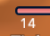

# hticks
Addon for FFXI / AshitaXI v4 that displays a resting tick countdown timer.
This addon is similar to ticker, but has been completely rewritten using imgui
and gdifonts to provide graphical configuration options and significantly nicer
looking text. The configuration menu can be opened by using the command /hticks
(or /ht).

## Install
Download the latest packaged release and copy the contents of the zip file to
your addons folder (\HorizonXI\Game\addons\).

*IMPORTANT NOTE* If you are updating from 1.0.x to 1.1.x, you will *need* to
delete your current hticks config folder (\HorizonXI\Game\config\addons\hticks),
or you will get errors and the addon will not load properly.

## Commands:
 `/hticks` or `/ht` *Brings up the configuration menu*