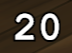

# hticks
Addon for FFXI / AshitaXI v4 that displays a healing tick countdown timer.
The idea for this addon is based off of ticker which was originally written
by Almavivaconte & ported to Ashita v4 by Zal Das, & GetAwayCoxn. It has
been completely rewritten using imgui to provide more graphical options.

## Commands:
### /hticks or /ht
 `/ht` *Brings up the configuration menu*